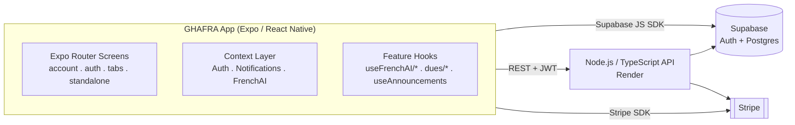

<div align="center">

# 🇬🇭 GHAFRA 🇫🇷
### The community app for the Ghanaian diaspora in France

[](https://expo.dev)
[](https://reactnative.dev)
[](https://www.typescriptlang.org/)
[](https://supabase.com)
[](https://stripe.com)
[](https://nodejs.org)
[](https://docs.expo.dev/eas)
[](#)
[](#)
 
**AI providers powering the French tutor & interview coach:**
 
[](https://www.anthropic.com)
[](https://x.ai)
[](https://ai.meta.com/llama)
[](https://huggingface.co/hexgrad/Kokoro-82M)

**[🇬🇧 Read in English](#-english)** · **[🇫🇷 Lire en français](#-français)**

</div>

---

## 🇬🇧 English

### About

**GHAFRA** is a cross-platform mobile app (iOS & Android, live on the App Store and Play Store) built to connect the Ghanaian community living in France. It's the community's digital home base: a digital membership card, dues & donations, a community hub (events, housing, jobs, services, airport pickup, guided tours), an AI-powered French tutor, and the organisation's public-facing "about/team" pages, all in one native app, backed by a Node.js/TypeScript API and Supabase.

### Key Features

**Authentication & Account**
- Supabase Auth (Google & Apple Sign-In) with a resilient session/profile state machine (`loading -> unauthenticated -> needs_profile -> authenticated`) that survives flaky networks without wrongly signing users out
- Guided profile-completion flow (avatar, gender, city, occupation, Ghana & France phone numbers)
- Full account area: profile management, transaction history and payment confirmation screens

**Digital Membership Card**
- A dedicated `(card)` tab presenting the member's digital GHAFRA membership card

**Dues & Donations**
- Stripe React Native `PaymentSheet` integration end-to-end: the backend creates a `PaymentIntent`, the app collects payment, then confirms it server-side, covering recurring membership dues and one-off donations, with a success screen and transaction history

**Community Hub**
- Event calendar for community gatherings
- Photo gallery
- "GHAFRA Care" — member support/welfare services
- Housing listings board
- Job & internship board, with detail screens per listing
- Marketplace / local services directory
- Airport pickup booking for newcomers
- Guided tours of France for members

**AI French Tutor** (`frenchAI` module, reached from the `(learn)` tab)
- CEFR-based learning (A1 to C2) shared across the module via a dedicated React context
- A full practice suite, each backed by its own hook: chat, dictation, fill-in-the-blank, flashcards, pronunciation scoring, reading comprehension, roleplay scenarios, vocabulary quizzes and writing correction (`useChat`, `useDictation`, `useFillBlank`, `useFlashcards`, `usePronunciationScore`, `useReadingComprehension`, `useTranscribe`, `useTTS`, `useVocabQuiz`, `useWritingCorrection`, ...)
- On-device voice capture via **Picovoice** feeding a floating "Voice Orb" AI tutor widget available across the resource library
- A searchable, level-filterable library of free video lessons and reading resources, with English translations

**AI Interview Coach**
- A dedicated backend namespace (`/interview/*`) lets users store their CV, job description and personal context, then practice mock interview Q&A, including voice-recorded answers transcribed server-side

**Announcements & Notifications**
- Categorized announcement feed (news, events, housing, personal, community updates)
- Push notifications via `expo-notifications` and Expo push tokens, registered/deregistered with the backend and re-synced on app foreground and token refresh

**About, Team & Preferences**
- Public "About Us" and "Contact" pages
- "Meet the team" pages for engineers and executives
- User preference settings

**Custom Design System**
- A large shared component library (`Buttons`, `Cards`, `Forms`, `Inputs`, `Dropdowns`, `DatePicker`, `Selectors`, `Modals`, `Loading`, `Banners`, `Headers`, `Lists`, `Tabs`, `Payments`, `Sections`, `Screens`, `ImagePickers`, ...) plus a centralized theme/color system, keeping the whole app visually consistent

### Architecture



### Tech Stack

| Layer | Technology |
|---|---|
| Mobile framework | React Native 0.81 - Expo SDK 54 - Expo Router 6 |
| Language | TypeScript (+ a couple of legacy `.jsx` screens) |
| Navigation | Expo Router (file-based, route groups: `(account)`, `(auth)`, `(tabs)`, `(standalone)`) |
| State/data | React Context (Auth, Notifications, FrenchAI) + custom hooks per feature |
| Auth | Supabase Auth - Google Sign-In - Sign in with Apple |
| Database | Supabase (PostgreSQL) |
| Backend API | Node.js + TypeScript REST API (hosted on Render) |
| Payments | Stripe React Native SDK (`PaymentSheet`) |
| Voice/AI | Picovoice voice processor - server-side transcription (STT) & text-to-speech (TTS) |
| Notifications | expo-notifications + Expo push tokens |
| Animations | React Native Reanimated 4 - Worklets |
| Media | expo-image, expo-image-picker, expo-av, react-native-youtube-iframe |
| UI | Custom in-house component library + design tokens (`constants/theme.ts`, `Colors.js`) |
| Build & Release | EAS Build, EAS Submit, EAS Update (OTA) |
| Tooling | ESLint, EAS CLI, TypeScript |

### Project Structure (excerpt)

```
app/
├── (account)/                # Membership & payments account area
│   ├── paydues.tsx
│   ├── payment-success.tsx
│   ├── profile.tsx
│   └── transactions.tsx
├── (auth)/                   # Sign in / Sign up
│   ├── index.tsx, SignIn.tsx, SignUp.tsx
├── (tabs)/
│   ├── (home)/index.jsx
│   ├── (learn)/index.tsx           # entry point to the AI French tutor
│   ├── (card)/index.tsx            # digital membership card
│   ├── (community)/                # community hub
│   │   ├── eventCalendar.tsx, gallery.tsx, ghafra_care.tsx
│   │   ├── housing.tsx, jobInternship.tsx, marketservice.tsx
│   │   └── pickup.tsx, tour.tsx
│   ├── (more)/                     # about, contact, team, preferences
│   │   ├── aboutus.tsx, contact.tsx
│   │   ├── engineers.tsx, executives.tsx
│   │   └── preference.tsx
│   └── modal.tsx
└── (standalone)/
    ├── announcement/[id].tsx
    ├── frenchAI/                   # chat, dictation, fillBlank, flashcards,
    │   │                           # pronunciation, reading, roleplay, vocabQuiz, writing
    │   ├── useConversationEngine.ts, useFrenchAITutor.ts
    ├── frenchLesson/[id].tsx, frenchResource/[id].tsx
    ├── housingDetail/[id].tsx
    ├── JobInternship/{Jobdetailscreen,Summit}.tsx
    └── notifications.tsx

hooks/
├── useFrenchAI/               # useChat, useConfig, useDictation, useFillBlank,
│                               # useFlashcards, usePronunciationScore,
│                               # useReadingComprehension, useTranscribe, useTTS,
│                               # useVocabQuiz, useWritingCorrection
├── animation/, auth/, dues/
├── use-color-scheme.ts, use-theme-color.ts
└── useAnnouncements.ts

context/
├── AuthContext.tsx, NotificationContext.tsx, FrenchAIContext.tsx

components/
├── Banners, Buttons, Cards, DatePicker, Dropdowns, Empty, Forms
├── French, Headers, icons, ImagePickers, Images, Inputs, Lists
├── Loading, modals, Payments, Screens, Sections, Selectors, Tabs, ui

assets/data/
├── engineerData.ts, executivesData.ts, exploreSectionData.ts
├── frenchCities.ts, galleryData.ts, jobInternship.types.ts
├── occupations.ts, resources.data.ts, tourData/

constants/
├── Colors.js, supabase.ts, theme.ts

services/
└── api.ts        # typed fetch wrapper, Supabase JWT auth, interview endpoints
```

### Getting Started (local development)

```bash
# 1. Install dependencies
npm install

# 2. Configure environment
cp .env.example .env
# then fill in EXPO_PUBLIC_API_URL, EXPO_PUBLIC_SUPABASE_URL, etc.

# 3. Start the Expo dev server
npx expo start
```

This opens the Metro bundler with a QR code. From there:
- Scan the QR code with **Expo Go** (or your custom dev client) on a physical device
- Press `i` to open the iOS Simulator
- Press `a` to open the Android Emulator
- Press `w` to open the web build in a browser

### Environment Variables

| Variable | Purpose |
|---|---|
| `EXPO_PUBLIC_API_URL` | Base URL of the Node.js/TypeScript backend |
| `EXPO_PUBLIC_SUPABASE_URL` | Supabase project URL |
| `EXPO_PUBLIC_SUPABASE_ANON_KEY` | Supabase anonymous/public key |
| `EXPO_PUBLIC_STRIPE_PUBLISHABLE_KEY` | Stripe publishable key |

### Building for Production (EAS)

Production builds, OTA updates and store submissions are handled by **EAS (Expo Application Services)**. Make sure `eas.json` defines a `production` build profile, then run:

```bash
# iOS — build and automatically submit to App Store Connect
npx eas-cli@latest build --platform ios --profile production --auto-submit

# Android — build the production artifact (AAB)
npx eas-cli@latest build --platform android --profile production
```

**Over-the-air (OTA) updates** — ship a JS/asset-only update to production users without a new store release:

```bash
npx eas-cli@latest update --branch production --message "Enhanced pickup screen design" --platform ios
```

**Submitting to the stores** — if you skipped `--auto-submit`, or need to resubmit a specific build:

```bash
npx eas submit --platform ios --profile production
```

### Getting your build artifacts (the app binaries)

Once a build finishes on EAS's servers, the resulting `.ipa` (iOS) or `.aab`/`.apk` (Android) isn't sitting in this repo, it's downloaded from Expo:

```bash
# List recent builds with their status and download links
npx eas-cli@latest build:list --platform ios --limit 5
npx eas-cli@latest build:list --platform android --limit 5

# View a specific build (prints the artifact download URL)
npx eas-cli@latest build:view <build-id>
```

Each command prints a direct download URL for the binary, and the same builds are visible with a **Download** button on the project's [Expo dashboard](https://expo.dev). For Android, EAS can also build an installable `.apk` directly for internal testing by using the `preview` profile instead of `production` (`--profile preview`), which is easier to sideload than the `.aab` the stores require.

### Roadmap ideas
- CI/CD pipeline (GitHub Actions) triggering `eas build` and `eas update` on merge to `main`
- E2E tests with Detox/Maestro
- Backend repository & OpenAPI spec

### License
This project is proprietary, (c) GHAFRA. Contact the maintainer for usage inquiries.

### Contact
Have a question about the project? Open an issue or reach out to the maintainer.

<div align="right">

[Back to top](#-ghafra-)

</div>

---

## 🇫🇷 Français

### À propos

**GHAFRA** est une application mobile multiplateforme (iOS & Android, disponible sur l'App Store et le Play Store) conçue pour connecter la communauté ghanéenne vivant en France. C'est le point central numérique de la communauté : carte de membre digitale, cotisations & dons, un espace communautaire (événements, logement, emplois, services, navette aéroport, excursions), un tuteur de français propulsé par l'IA, et les pages publiques « à propos / équipe » de l'association, le tout dans une application native, appuyée par une API Node.js/TypeScript et Supabase.

### Fonctionnalités clés

**Authentification & Compte**
- Authentification Supabase (Google & Apple) avec une machine à états robuste (`loading -> unauthenticated -> needs_profile -> authenticated`) qui résiste aux réseaux instables sans déconnecter l'utilisateur à tort
- Parcours guidé de complétion de profil (avatar, genre, ville, profession, numéros de téléphone Ghana & France)
- Espace compte complet : gestion du profil, historique des transactions et écran de confirmation de paiement

**Carte de membre digitale**
- Un onglet `(card)` dédié présentant la carte de membre GHAFRA numérique

**Cotisations & Dons**
- Intégration complète du `PaymentSheet` Stripe React Native : le backend crée un `PaymentIntent`, l'application collecte le paiement puis le confirme côté serveur, pour les cotisations récurrentes comme pour les dons ponctuels, avec écran de succès et historique des transactions

**Espace communautaire**
- Calendrier des événements communautaires
- Galerie photo
- « GHAFRA Care » — services d'accompagnement et de soutien aux membres
- Espace annonces de logement
- Espace emploi & stages, avec écrans de détail par offre
- Répertoire de services locaux / marketplace
- Réservation de navette aéroport pour les nouveaux arrivants
- Excursions guidées en France pour les membres

**Tuteur de français IA** (module `frenchAI`, accessible depuis l'onglet `(learn)`)
- Apprentissage basé sur les niveaux du CECR (A1 à C2), partagé dans tout le module via un contexte React dédié
- Une suite d'exercices complète, chacun porté par son propre hook : chat, dictée, texte à trous, flashcards, évaluation de la prononciation, compréhension écrite, mises en situation, quiz de vocabulaire et correction de l'écriture (`useChat`, `useDictation`, `useFillBlank`, `useFlashcards`, `usePronunciationScore`, `useReadingComprehension`, `useTranscribe`, `useTTS`, `useVocabQuiz`, `useWritingCorrection`, ...)
- Capture vocale via **Picovoice** alimentant un widget flottant « Voice Orb », accessible sur toute la bibliothèque de ressources
- Une bibliothèque de ressources gratuites, filtrable par niveau et par recherche (vidéos, supports de lecture), avec traductions en anglais

**Coach IA pour entretiens**
- Un espace backend dédié (`/interview/*`) permet d'enregistrer son CV, l'offre d'emploi et son contexte personnel, puis de s'entraîner à des questions-réponses d'entretien, y compris avec des réponses vocales transcrites côté serveur

**Annonces & Notifications**
- Fil d'annonces catégorisé (actualités, événements, logement, personnel, mises à jour communautaires)
- Notifications push via `expo-notifications` et jetons push Expo, enregistrés/désenregistrés auprès du backend et resynchronisés au premier plan de l'application et lors du rafraîchissement du jeton

**À propos, Équipe & Préférences**
- Pages publiques « À propos » et « Contact »
- Pages « L'équipe » pour les ingénieurs et les dirigeants
- Réglages de préférences utilisateur

**Système de design personnalisé**
- Une large bibliothèque de composants partagés (`Buttons`, `Cards`, `Forms`, `Inputs`, `Dropdowns`, `DatePicker`, `Selectors`, `Modals`, `Loading`, `Banners`, `Headers`, `Lists`, `Tabs`, `Payments`, `Sections`, `Screens`, `ImagePickers`, ...) ainsi qu'un système de thème/couleurs centralisé, garantissant une cohérence visuelle sur toute l'application

### Architecture


### Stack technique

| Couche | Technologie |
|---|---|
| Framework mobile | React Native 0.81 - Expo SDK 54 - Expo Router 6 |
| Langage | TypeScript (+ quelques écrans `.jsx` historiques) |
| Navigation | Expo Router (basé sur les fichiers, groupes de routes `(account)`, `(auth)`, `(tabs)`, `(standalone)`) |
| État / données | Contextes React (Auth, Notifications, FrenchAI) + hooks personnalisés par fonctionnalité |
| Authentification | Supabase Auth - Google Sign-In - Sign in with Apple |
| Base de données | Supabase (PostgreSQL) |
| API backend | API REST Node.js + TypeScript (hébergée sur Render) |
| Paiements | SDK Stripe React Native (`PaymentSheet`) |
| Voix / IA | Picovoice (traitement vocal) - transcription (STT) et synthèse vocale (TTS) côté serveur |
| Notifications | expo-notifications + jetons push Expo |
| Animations | React Native Reanimated 4 - Worklets |
| Médias | expo-image, expo-image-picker, expo-av, react-native-youtube-iframe |
| UI | Bibliothèque de composants maison + tokens de design (`constants/theme.ts`, `Colors.js`) |
| Build & Publication | EAS Build, EAS Submit, EAS Update (mises à jour OTA) |
| Outillage | ESLint, EAS CLI, TypeScript |

### Structure du projet

Voir la section [Project Structure](#project-structure-excerpt) en anglais ci-dessus, l'arborescence est identique.

### Démarrage rapide (développement local)

```bash
# 1. Installer les dépendances
npm install

# 2. Configurer l'environnement
cp .env.example .env
# puis renseigner EXPO_PUBLIC_API_URL, EXPO_PUBLIC_SUPABASE_URL, etc.

# 3. Lancer le serveur de développement Expo
npx expo start
```

Cela ouvre le bundler Metro avec un QR code. À partir de là :
- Scannez le QR code avec **Expo Go** (ou votre dev client personnalisé) sur un appareil physique
- Appuyez sur `i` pour ouvrir le simulateur iOS
- Appuyez sur `a` pour ouvrir l'émulateur Android
- Appuyez sur `w` pour ouvrir la version web dans un navigateur

### Variables d'environnement

| Variable | Rôle |
|---|---|
| `EXPO_PUBLIC_API_URL` | URL de base de l'API backend Node.js/TypeScript |
| `EXPO_PUBLIC_SUPABASE_URL` | URL du projet Supabase |
| `EXPO_PUBLIC_SUPABASE_ANON_KEY` | Clé publique/anonyme Supabase |
| `EXPO_PUBLIC_STRIPE_PUBLISHABLE_KEY` | Clé publique Stripe |

### Build de production (EAS)

Les builds de production, les mises à jour OTA et les soumissions aux stores sont gérés par **EAS (Expo Application Services)**. Assurez-vous que `eas.json` définit un profil de build `production`, puis lancez :

```bash
# iOS — build et soumission automatique à App Store Connect
npx eas-cli@latest build --platform ios --profile production --auto-submit

# Android — build de l'artefact de production (AAB)
npx eas-cli@latest build --platform android --profile production
```

**Mises à jour OTA (over-the-air)** — publier une mise à jour JS/assets vers les utilisateurs en production sans nouvelle release sur les stores :

```bash
npx eas-cli@latest update --branch production --message "Amélioration du design de l'écran pickup" --platform ios
```

**Soumission aux stores** — si `--auto-submit` n'a pas été utilisé, ou pour resoumettre un build spécifique :

```bash
npx eas submit --platform ios --profile production
```

### Récupérer les artefacts de build (les binaires de l'app)

Une fois un build terminé sur les serveurs d'EAS, le `.ipa` (iOS) ou le `.aab`/`.apk` (Android) résultant ne se trouve pas dans ce dépôt : il se télécharge depuis Expo :

```bash
# Lister les builds récents avec leur statut et lien de téléchargement
npx eas-cli@latest build:list --platform ios --limit 5
npx eas-cli@latest build:list --platform android --limit 5

# Voir un build spécifique (affiche l'URL de téléchargement de l'artefact)
npx eas-cli@latest build:view <build-id>
```

Chaque commande affiche une URL de téléchargement directe pour le binaire, et les mêmes builds sont visibles avec un bouton **Download** sur le [tableau de bord Expo](https://expo.dev) du projet. Pour Android, EAS peut aussi construire un `.apk` installable directement pour les tests internes en utilisant le profil `preview` plutôt que `production` (`--profile preview`), plus simple à sideloader que le `.aab` exigé par les stores.

### Pistes d'évolution
- Pipeline CI/CD (GitHub Actions) déclenchant `eas build` et `eas update` sur merge vers `main`
- Tests E2E avec Detox/Maestro
- Dépôt backend & spécification OpenAPI

### Licence
Projet propriétaire, (c) GHAFRA. Contactez le mainteneur pour toute question d'utilisation.

### Contact
Une question sur le projet ? Ouvrez une issue ou contactez le mainteneur.

<div align="right">

[Retour en haut](#-ghafra-)

</div>